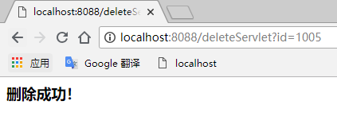

数据库配置

驱动:  com.mysql.jdbc.Driver

url:  jdbc:mysql://localhost:3306/sakila

用户名：root

密码：root

项目目录结构
```$xslt
    bean:实体类
    dao：数据库操作层
    service:业务逻辑处理层
    filter：过滤器
    servlet：页面请求控制器
    utils：工具类
```
项目操作步骤

```$xslt
1、启动项目，进入index页面，可以看到此项目的
功能按钮，即登陆和电影列表展示。


2、若直接点击电影列表或者不进行登陆直接输入url，跳转至登陆页面，
登陆成功后，再次点击电影列表，成功访问到电影列表。

3、列表展示所有电影，后面有新增，修改，删除按钮。

4、点击新增后，显示新增输入界面，点击提交按钮，若新增成功，
则提示用户。点击修改按钮，用户可以看到电影详情，并可以
进行相应的修改，点击提交按钮，若修改成功，则提示用户。点击删除按钮，
删除相应的影片，删除成功后提示用户。
```
项目运行截图





"# Exam-20688-20180813-1" 
